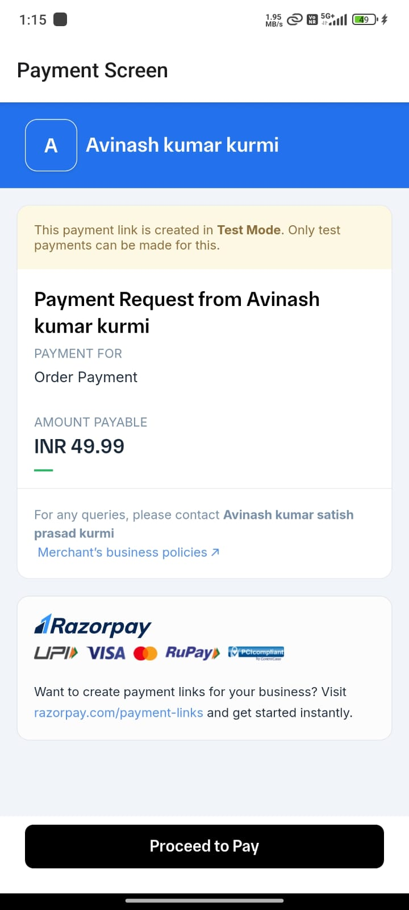

## 📚 E-Learning App

- **E-Learning App** is an advanced online education platform designed to provide an effective digital environment for learning and teaching.  
- Allows **students to enroll in courses**, access **educational videos**, and earn **certificates** upon completion.  
- Built using:  
  - **Front-end:** React Native  
  - **Back-end:** Node.js, Express.js, PostgreSQL  
- Ensures a **seamless and robust user experience** across the platform.  
- **Instructors must submit resumes** for **admin approval** before they can create and manage courses, ensuring high-quality educational content through a verification process.  
- Features a **user-friendly interface** that prioritizes **simplicity** and **easy navigation**.  
- **Email-only authentication** simplifies the signup/login process and account management.  
- Core features include:  
  - 🎥 Video streaming  
  - 🗂️ Course management  
  - 🏆 Certification generation  
- Aims to enhance digital education by providing a **comprehensive, accessible, and efficient** solution for students and educators.

## App Screen Shots





## Get started

1. Install dependencies

   ```bash
   npm install
   ```

2. Start the app

   ```bash
    npx expo start
   ```

